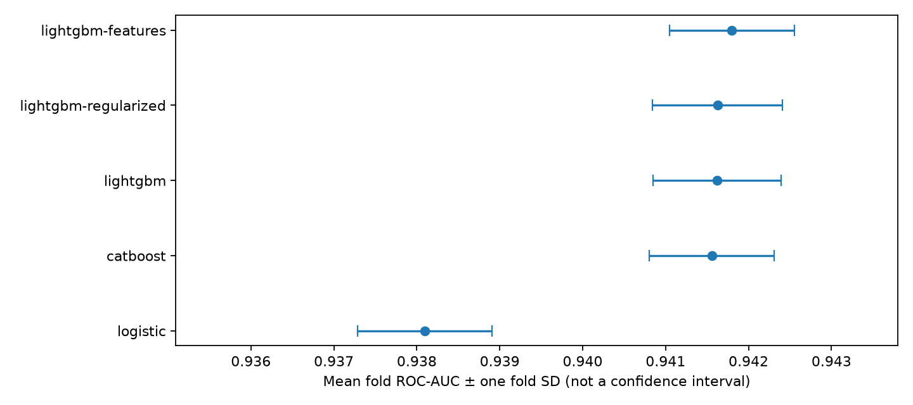
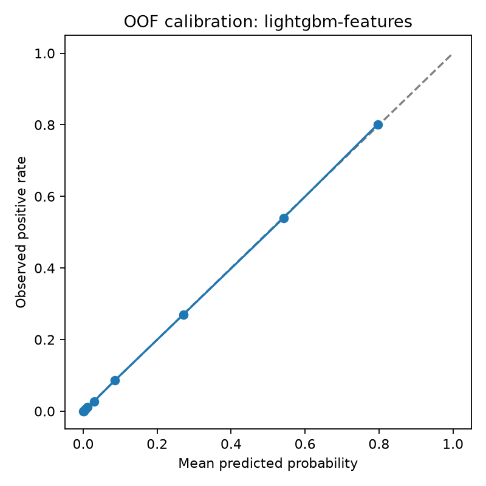

# EV purchase prediction — experiment report

Run date: 2026-09-09. Synthetic Kaggle Playground S6E9 data; this is a competition case study, not a validated real-world purchase forecasting system.

Train: 668,665 rows. Test: 286,571 rows. Positive class: Yes (17.46%). IDs are excluded from features. See [data checks](data-summary.json).

## Validation and selection

All runs use the same five stratified folds and seed 42. Numeric imputation/scaling and categorical encoding are fitted within each training fold. CatBoost uses native categorical features. Test predictions average the five saved models. Every fold artifact was reloaded and its predictions checked against the in-memory model.

Selection uses mean fold ROC-AUC; leaderboard scores do not select parameters. Fixed iteration budgets avoid early-stopping selection on the evaluation fold. Repeated development on the same folds still introduces selection optimism; there is no independent labeled final holdout.

## Results

| Run | Mean fold AUC | Fold SD | OOF AUC | Log loss | AP | Wall seconds |
|---|---:|---:|---:|---:|---:|---:|
| lightgbm-features | 0.941800 | 0.000756 | 0.941788 | 0.226586 | 0.755487 | 63.0 |
| lightgbm-regularized | 0.941626 | 0.000784 | 0.941616 | 0.226911 | 0.754828 | 77.7 |
| lightgbm | 0.941622 | 0.000772 | 0.941610 | 0.226889 | 0.754815 | 40.1 |
| catboost | 0.941558 | 0.000754 | 0.941551 | 0.227015 | 0.754817 | 250.1 |
| logistic | 0.938096 | 0.000809 | 0.938094 | 0.233295 | 0.741069 | 14.7 |

**Selected: lightgbm-features.** The fold standard deviation is descriptive, not a confidence interval. Timings include validation/test prediction and artifact checks; runs overlapped on the same machine and are not controlled speed benchmarks.

## Improvement experiments

- lightgbm-regularized: mean AUC delta +0.000004 vs LightGBM baseline; improved 2/5 folds. Paired fold deltas: -0.000006, -0.000017, +0.000054, -0.000038, +0.000027.
- lightgbm-features: mean AUC delta +0.000178 vs LightGBM baseline; improved 5/5 folds. Paired fold deltas: +0.000205, +0.000130, +0.000136, +0.000189, +0.000228.

## Error analysis

The following diagnostics use selected-model OOF probabilities. A threshold of 0.5 is used only to describe errors, not as an optimized business decision rule.

Confusion matrix [[TN, FP], [FN, TP]] at 0.5: `[[522507, 29379], [38430, 78349]]`.

| Segment | Value | Rows | Positives | Positive rate | AUC | Log loss |
|---|---|---:|---:|---:|---:|---:|
| City_Type | Rural | 123,983 | 23,977 | 0.193 | 0.936843 | 0.246114 |
| City_Type | Suburban | 255,377 | 46,207 | 0.181 | 0.941163 | 0.231417 |
| City_Type | Urban | 289,305 | 46,595 | 0.161 | 0.944246 | 0.213953 |
| Gender | Female | 295,427 | 52,480 | 0.178 | 0.941684 | 0.228512 |
| Gender | Male | 367,954 | 63,381 | 0.172 | 0.941960 | 0.224866 |
| Gender | Other | 5,284 | 918 | 0.174 | 0.934926 | 0.238731 |
| Home_Charging_Possible | No | 205,988 | 26,178 | 0.127 | 0.947154 | 0.185646 |
| Home_Charging_Possible | Yes | 462,677 | 90,601 | 0.196 | 0.938307 | 0.244813 |
| Range_Anxiety_Level | High | 2,194 | 3 | 0.001 | 0.949034 | 0.008969 |
| Range_Anxiety_Level | Low | 603,972 | 114,167 | 0.189 | 0.939037 | 0.239764 |
| Range_Anxiety_Level | Medium | 62,499 | 2,609 | 0.042 | 0.932022 | 0.106879 |

Rural rows have lower AUC than Urban rows, and the Medium range-anxiety segment has lower AUC than Low. These are candidates for further error inspection, not evidence that a new feature will help. High range-anxiety has very few positives; its apparently strong AUC should not be treated as stable.

Segment differences are descriptive, depend on class prevalence and difficulty, and do not establish causal effects or fairness. Synthetic data can contain generator artifacts.

## Reproducibility and limitations

- Full configs, source/data/fold SHA-256 fingerprints, Git revision, and individual fold metrics are in [metrics](metrics/). Dependencies are pinned in requirements.txt.
- Raw data, OOF rows, submission files and model binaries stay in ignored local artifacts. Download data through Kaggle under competition rules.
- All models ran on CPU with eight threads each. No GPU, external data, copied competition notebook, pseudo-labeling or ensemble search was used.
- Random stratified CV assumes exchangeable rows. This does not demonstrate temporal or customer-group generalization. Data checks report duplicate feature rows.
- AUC measures ranking; probability calibration and practical thresholds require further independent validation.
- Final private leaderboard results are unavailable while the competition is open. No final rank or medal is claimed.
