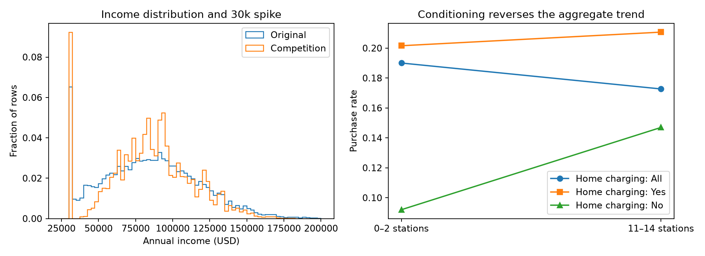

# Round 2 — expert-informed data investigation and leaderboard attempt

Target: exceed Chris Deotte's observed public AUC of **0.94672**. This round extends the initial five-model case study.

## What changed after studying experts

See [research and attribution](research.md) for public sources, hypotheses and independent checks. The major gain came from representing repeated synthetic values with original-data statistics, frequency features and internally cross-fitted target encodings. The public Chris Deotte notebooks are starters, not a disclosed reproduction of his leading submission.



## Fold-0 screens

All screens use the same outer fold. These are development comparisons, not full cross-validation results.

| Run | Fold-0 AUC | Best iteration | Expanded to five folds |
|---|---:|---:|---|
| r2-fine-lgb | 0.945081 | 1150 | No |
| r2-full-lgb | 0.945073 | 744 | Yes |
| r2-full-xgb | 0.945022 | 752 | Yes |
| r2-lean-lgb | 0.945108 | 1230 | No |
| r2-native-cat | 0.944514 | 1887 | No |
| r2-recipe | 0.941409 | 2119 | No |
| r2-residual-lgb | 0.945032 | 867 | No |
| r2-transductive-lgb | 0.945102 | 1343 | No |
| r2-xgb-depth4 | 0.945030 | 1521 | No |

## Completed five-fold models

| Run | Mean fold AUC | OOF AUC | OOF log loss |
|---|---:|---:|---:|
| r2-full-lgb | 0.945975 | 0.945966 | 0.218543 |
| r2-full-xgb | 0.945978 | 0.945970 | 0.218558 |

## Blend selection

Only models with complete, aligned OOF predictions are eligible. A small grid of fixed weights is compared on mean fold AUC. Rank outputs are ranking scores, not calibrated probabilities. Detailed candidate grids and correlations are saved in [run records](runs/).

## Kaggle results

| Submission | Description | Public AUC | Status |
|---|---|---:|---|
| 56119769 | Round2: expert-informed cross-fitted TE, original stats; LGB/XGB 50:50 rank blend selected by 5-fold CV 0.946021 | 0.94618 | SubmissionStatus.COMPLETE |
| 56119531 | ml-template: CV-selected LightGBM charging/commute features; mean 5-fold AUC 0.941800; seed 42 | 0.94160 | SubmissionStatus.COMPLETE |
| 56119454 | ml-template: logistic baseline, 5 fixed folds, seed 42, train-fold preprocessing | 0.93738 | SubmissionStatus.COMPLETE |

Best observed public AUC: **0.94618**. Gap to the requested 0.94672 target: **+0.00054**. The target has not been exceeded.

## Interpretation and limits

- The original recipe explains broad behavior; original-value repetition and synthetic-generator distortions explain why the initial generic pipeline left substantial signal unused.
- Two full-feature tree models have OOF correlation around 0.99932, limiting ensemble gains. Small screening changes do not establish robust improvement.
- Residual/replication features failed their initial screen. Native CatBoost was weaker alone; its 25% blend gain on fold 0 was tiny. Negative results are retained.
- Fold 0 was reused for screening. Outer-fold early stopping also uses that fold's labels. These are development OOF scores, with selection optimism; they are not an independent final generalization estimate.
- Transductive candidates, if present, use train+test feature frequencies only. Test targets are never available. Supervised encoders remain confined to outer training labels with inner cross-fitting.
- Original data are public CC0 data. Raw data, reference notebooks, predictions and model artifacts are not committed. Public sources are credited; no external prediction files were submitted or averaged.
- Final private leaderboard results remain unavailable. GPU CatBoost can vary across runs. No final rank or medal is claimed.

## Reproduce

Install the pinned requirements and download the public original dataset using the command in the README. Examples:

```bash
python -m src.investigate
python -m src.plot_investigation
python -m src.expert --output artifacts/new-full-lgb --model lgb --mode full --rounds 6000
python -m src.expert --output artifacts/new-full-xgb --model xgb --mode full --rounds 5000
python -m src.blend_experts --runs artifacts/new-full-lgb artifacts/new-full-xgb --output artifacts/new-blend
python -m src.predict_expert --run artifacts/new-blend --test data/ev-purchases/test.csv --output artifacts/reproduced.csv
```

Per-run records include actual saved estimator parameters and encoder classes; these override the shared runner's original parameter dictionary for fine-bin variants. Original-source and training-data hashes are recorded for complete runs.
