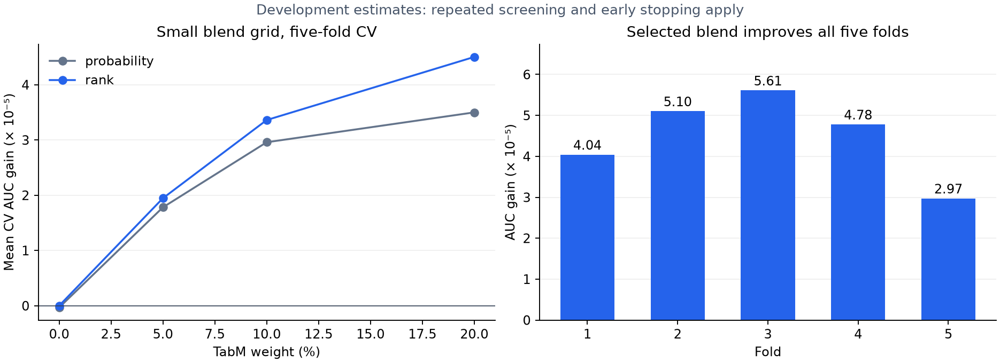

# Round 3 — testing conditional effects and model diversity

Best public submission entering this round: **0.94618**, below the requested **0.94672** target. The round-two LightGBM/XGBoost probability blend scores 0.945090357 on development fold 0. All screens below use that same split; these are selection estimates, not an independent holdout.

## Research and hypotheses

Repeated exact income values contain signal, but a marginal target mean may confound income effects with subsidy, concern and anxiety. Two experiments test alternatives: conditional target encodings and jointly fitted sparse coefficients for exact numeric values, accompanied by smooth spline effects.

For a different model family, we inspected [yhay81's public TabM baseline](https://www.kaggle.com/code/yhay81/simple-tabm-baseline-s6e9) and [Tamerlan Omralinov's Offset Residual Net notebook](https://www.kaggle.com/code/tamerlanomralinov/s6e9-the-best-dl-model-insights). The former uses numeric digit views and an efficient small TabM ensemble. The latter reports that its neural variants trail boosting; its title is not evidence of leaderboard superiority. No notebook predictions were downloaded or used.

Our independent TabM screen uses the [official TabM package](https://github.com/yandex-research/tabm), compact raw/recipe/digit views, original-data means and inner-cross-fitted exact-income/commute target encodings. Quantile scaling is fitted only on each outer training fold. It retains the existing split and saves preprocessing, model weights and validation predictions. Binary cross entropy is applied separately to each ensemble member; inference averages probabilities. The purpose is to measure complementary errors, not assume that neural models win.

## Initial screens

| Model | Fold 0 AUC | Decision |
|---|---:|---|
| Existing two-tree probability blend | 0.945090357 | Reference |
| Conditional-key XGBoost | 0.944914899 | No expansion; 25% blend adds only 0.000010691 |
| Sparse exact-value logistic, C=0.1 | 0.941772156 | Reject; blending worsens reference |
| Sparse exact-value logistic, C=1 | 0.943124953 | 700-iteration limit reached; 5% blend adds only 0.000008290 |

Small gains on this repeatedly reused fold do not justify a leaderboard submission. Conditional keys create sparse groups and may increase estimation noise; this is an interpretation of the result, not a proven causal explanation. Further runs and their blend screens are recorded in `screens.json`.

The C=1 sparse model was rerun to convergence (929 iterations), reaching 0.943139913; its best screened blend improves the reference by only 0.000008850. C=10 reached 0.942672122 before the 700-iteration cap. Adding the public original rows to LightGBM with weight 0.25 reached 0.944746645 and did not improve the reference blend. These results do not warrant five-fold expansion.

Reproduction (from the repository root):

```bash
.venv/bin/python -m src.conditional --output artifacts/r3-conditional --model xgb --folds 0 --rounds 6000
.venv/bin/python -m src.sparse_values --output artifacts/r3-sparse-c1-converged --c 1 --iterations 3000
.venv/bin/python -m src.original_augmentation --output artifacts/r3-original-aug --model lgb --folds 0 --rounds 6000
.venv/bin/python -m src.screen_round3
```

## Neural and native-category follow-up

The first TabM screen reached **0.944390780** (best epoch 16). A fixed 10% probability blend with the two-tree reference reached **0.945119157**, a +0.000028799 development-fold gain. This is the strongest complementary result so far and motivates checking the other four folds. Reloading its checkpoint and preprocessing reproduced all 286,571 test predictions within 2.99e-8 after CSV serialization; see `neural-inference-check.json`.

A second TabM screen tests piecewise-linear numeric embeddings with 32 members and width 256. This changes both representation and capacity, so it is a candidate comparison rather than an isolated causal ablation. Quantile bin edges are fitted on the outer training data only. The numerical embedding implementation comes from [the authors' package](https://github.com/yandex-research/rtdl-num-embeddings).

A separate XGBoost screen treats repeated exact income and commute values as native categorical features in addition to existing numeric/target-encoded views. This tests node-specific category partitions instead of fixed marginal target statistics. [XGBoost's categorical documentation](https://xgboost.readthedocs.io/en/stable/tutorials/categorical.html) describes these partitions. Category names are strings; unseen values become missing under the fitted category vocabulary. The first attempt exposed unsupported floating-point category names and was fixed before any successful fit.

Optional neural reproduction:

```bash
uv pip install --python .venv/bin/python torch==2.11.0 --index-url https://download.pytorch.org/whl/cu128
uv pip install --python .venv/bin/python -r requirements-neural.txt
.venv/bin/python -m src.neural --output artifacts/new-tabm --folds 0,1,2,3,4
.venv/bin/python -m src.collect_folds --run artifacts/new-tabm
.venv/bin/python -m src.predict_neural --run artifacts/new-tabm --fold 0 --output artifacts/new-tabm/reloaded-fold0.csv
```

The native-category XGBoost run reached 0.943596689 and did not improve the reference blend. The larger piecewise TabM reached 0.944321441; its best screened 10% blend (0.945117706) was slightly below the smaller TabM blend, with substantially higher runtime. We expanded the smaller linear-embedding TabM to five folds; this comparison does not establish that one embedding type is generally superior.

## Five-fold result

The smaller TabM completed five folds with pooled OOF AUC **0.945174002**. We screened 0%, 5%, 10% and 20% TabM weights, keeping the remaining weight split equally between the existing LightGBM and XGBoost, for probability and rank blending.

The selected **40% LightGBM / 40% XGBoost / 20% TabM rank blend** reached mean fold AUC **0.946065777** and pooled OOF AUC **0.946066061**, versus the previous rank blend's mean **0.946020747**. The mean increase is **0.000045030**, with positive gains on all five folds. The overall experiment includes nine successful run configurations and thirteen fold fits, plus the documented failed categorical-dtype attempt.



These small, consistent development gains justify one submission, but do not establish a statistically significant improvement or guarantee an increase on the public/private leaderboard. Checkpoint provenance and complete fold histories are saved in `runs/`; the eight full-OOF blend candidates and selected weights are in `selected.json`. No claims are based on the private leaderboard.


## Submission and verification

Submission **56120517**, submitted on **2026-09-09 at 10:41:50 UTC**, scored **0.94618** publicly, tying the previous best. The requested **0.94672** target remains unbeaten, with a **0.00054** public AUC gap. We did not adjust blend weights or submit additional variants in response to this public score. The older two-tree blend remains the simpler incumbent; the neural blend has better development CV but no demonstrated public-score advantage.

Independent inference from all fifteen saved fold models reproduced the entire **286,571-row** submission **exactly** (maximum absolute difference 0, identical SHA-256). Both files passed ID-order, row-count, finite-probability and range validation. All **six automated tests** passed. The fold-zero neural reload check is recorded separately; its tiny difference comes from float32 CSV serialization. Public submission history is in `submissions.json`; final private scores are unavailable.

The useful outcome of this round is a reproducible neural complement with consistent development-fold gains, and negative evidence for conditional keys, direct source-row augmentation and native exact-value partitions under the tested settings. The public result does not support claiming that this round improved the leaderboard score.
