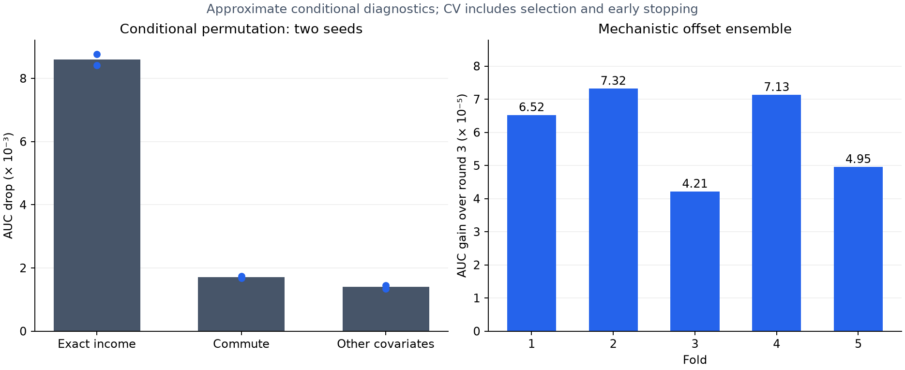

# Round 4 — model the mechanism, then its deviations

Starting public best: **0.94618**. Target: **0.94672**. This round asks which information the existing models leave unused, rather than starting with another architecture search.

## What the data says

The [previous source-data investigation](../round2/research.md) identified a probit purchase mechanism: the probability is the normal CDF of `-5.5 + 1.2 × income/100000 + 0.6 × concern + 2 × subsidy_yes − anxiety_medium − 3 × anxiety_high`.

We refitted these six coefficients separately inside each of the five training folds, using numerically stable log-CDF likelihoods. Pooled OOF AUC increased only from **0.937690453** for the original score to **0.937759459** for the refitted mechanism. Changing the global coefficients alone does not recover the existing XGBoost's **0.945970499** OOF AUC. The fitted coefficients and group residuals are in `mechanism.json`.

The high-anxiety group contains only **3 positive labels among 2,194 rows**, compared with one positive among 167 original-source rows. Its fitted coefficient is therefore poorly supported; no deterministic label rules or claims about its exact magnitude are justified. Several average residuals change sign across folds. We avoided turning those unstable patterns into hand-written corrections.

To probe finer signals, we permuted validation covariates within `income bin of 1000 × concern × subsidy × anxiety`, using a saved fold-zero XGBoost. We rebuilt every derived feature after each permutation and repeated with two seeds:

| Permuted block | AUC drop, seed 42 | AUC drop, seed 43 |
|---|---:|---:|
| Exact income, within its 1,000-dollar bin and core group | 0.008416 | 0.008766 |
| Commute, within the same strata | 0.001678 | 0.001735 |
| Remaining covariates, shuffled together within strata | 0.001449 | 0.001344 |

Exact income identity matters substantially beyond its coarse magnitude. Commute and the other covariates still carry useful predictive information, so dropping them wholesale is not supported. This is approximate conditional permutation, not a causal effect: the strata do not preserve every dependency, and the income permutation also changes its derived encodings. Full results are in `conditional-permutation.json`.



## Experiments motivated by the audit

**Mechanistic offset.** Fit the six-parameter probit inside the outer training fold, convert probabilities to log-odds, and supply them as XGBoost's `base_margin` during training, validation and inference. Trees learn an additive correction to these log-odds. This differs from the earlier residual target-encoding experiment: the mechanism is now the model's actual starting prediction, not another candidate feature. The [XGBoost offset documentation](https://xgboost.readthedocs.io/en/stable/tutorials/intercept.html) describes this interface and its link-function requirements. The existing tree feature set and hyperparameters are retained; three helper indicators are removed before tree fitting.

The first screen improved fold-zero XGBoost AUC from **0.945021954 to 0.945129992**. We expanded it to the remaining four folds.

**Risk-adjusted exact-value effects.** A marginal income target mean can conflate a value's own association with the mixture of subsidy/concern/anxiety among its rows. We estimate a regularized group log-odds correction conditional on the probit risk instead. Both the probit fit and group-effect estimation are repeated inside each inner training split before encoding its held-out rows. Unseen values receive zero correction. Two new features capture income and commute effects; the shrinkage penalty is fixed at 5. This is tested against the offset model, not assumed to help.

All model scores are development estimates: the same outer folds have been reused for model selection and early stopping. A higher CV score does not guarantee a higher leaderboard score.

## Completed validation

The risk-adjusted effect features reached fold-zero AUC **0.945008238**, below the offset model's **0.945129992**. We did not expand that candidate. Conditional interpretation alone is not sufficient; this particular encoding did not improve the measured result.

The offset XGBoost completed all five folds with pooled OOF AUC **0.946076181**, compared with the original XGBoost's **0.945970499**. An eight-candidate blend grid, keeping LightGBM and offset XGBoost equally weighted and testing 0%, 5%, 10% and 20% TabM, selected a **45% LightGBM / 45% offset XGBoost / 10% TabM rank blend**.

Its mean fold AUC is **0.946126032** and pooled OOF AUC **0.946125957**. Relative to round three's selected blend, the mean improvement is **0.000060255**, with positive fold gains of **0.00006519, 0.00007316, 0.00004211, 0.00007128 and 0.00004953**. The candidate grid, weights and paired differences are recorded in `selected.json`.

The round includes five fold-trained probit diagnostics, six conditional-permutation evaluations, five offset-boosting fits and one risk-adjusted-encoding screen. The eight automated tests passed, including checks that conditional group effects remove explained marginal rate differences and saved offset models restore their baseline margins at inference.

Reproduction:

```bash
.venv/bin/python -m src.mechanism
.venv/bin/python -m src.conditional_permutation
.venv/bin/python -m src.offset_boost --output artifacts/new-offset --model xgb --folds 0,1,2,3,4 --rounds 5000
.venv/bin/python -m src.mechanistic_encoding --output artifacts/new-risk-effects --model xgb --folds 0 --rounds 5000
.venv/bin/python -m src.blend_experts --runs artifacts/r2-full-lgb artifacts/new-offset artifacts/r3-tabm --small-third --output artifacts/new-mechanism-blend
.venv/bin/python -m src.predict_expert --run artifacts/new-mechanism-blend --test ~/.cache/kaggle/playground-series-s6e9/test.csv --output artifacts/new-mechanism-blend/reproduced.csv
```

Neural inference requires the optional dependencies described in the [round three report](../round3/report.md). Fitted offset coefficients and source fingerprints are saved in `offset-provenance.json`.

Independent inference from all fifteen saved models reproduced the 286,571-row submission exactly, with identical SHA-256 and maximum absolute difference zero. Submission validation checked row count, ID order and finite probabilities in range. See `inference-check.json`.


## Public result

Submission **56120745**, submitted **2026-09-09 at 10:55:26 UTC**, scored **0.94624**, improving the previous best **0.94618** by **0.00006**. It remains **0.00048** below the requested **0.94672** target. This one successful submission supports the tested mechanistic-offset implementation; it does not prove that every mechanism-inspired change will help, as the failed risk-adjusted encoding illustrates. No further public-score-driven weight adjustments were made in this round.

The new blend becomes the incumbent because both development CV and the observed public score improved. Final private leaderboard performance is still unknown. Complete public submission history is preserved in `submissions.json`.
